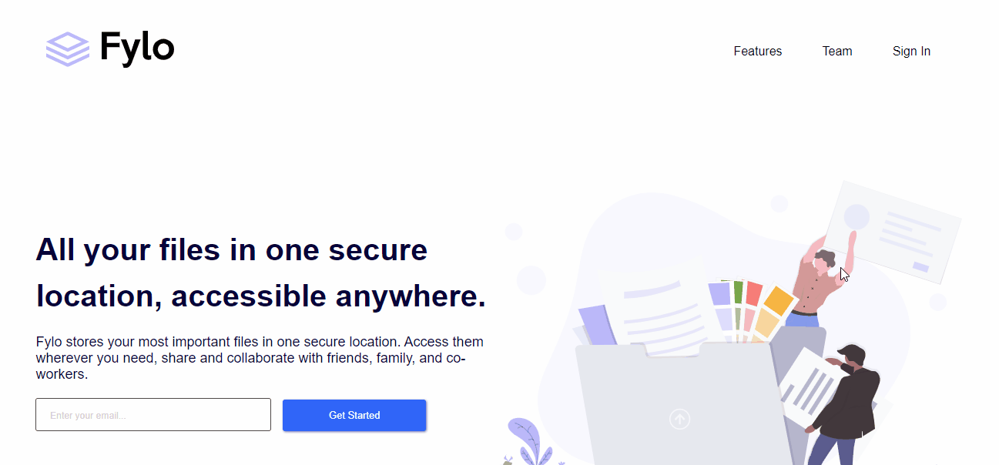

# Fylo - Landing Page
## Landing page com design responsivo, menu mobile e campos de digitação 🧩

Usei este projeto para aprimorar meus conhecimentos em CSS, especialmente Display Grid.

 Com esta landing page eu aprendi muita coisa, especialmente quando usar o Grid, quando usar o Flex e como resolver problemas de responsividade usando media queries.
 
 ## Versão mobile

 

 ## Tecnologias utilizadas
 - HTML
 - CSS
